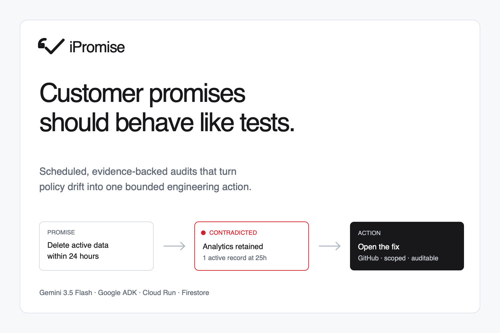

# iPromise

**Customer promises should behave like tests.**



iPromise is an autonomous promise-assurance agent for the [All Things Agentic Hackathon](https://allthingsagentichackathon.devpost.com/). It captures exact customer-facing claims, binds supported claims to approved controls, tests real product behaviour, and routes a source-grounded finding to the safest useful action: a verified draft pull request, a GitHub issue, or a configured email escalation.

The hackathon MVP focuses on one complete Taskmaster workflow: verifying an account-deletion promise across synthetic application and analytics records. It does **not** claim legal compliance and does not pretend every promise is executable.

## Status

The minimum vertical slice is implemented and tested locally. It runs the synthetic
product, deterministic audit agent, and Promise Ledger together; proves the virtual
T0+1h/T0+25h deletion mismatch; supports GitHub App installation and repository
selection; persists cloud-mode runs and OAuth state in Firestore; accepts an
authenticated scheduled trigger; and routes one contradiction through a locked
red-before/green-after Cloud Build verifier contract to an exact-byte draft-PR
publisher. Integration tests cover concurrent runs, remote reconciliation, and
checkpoint recovery. Those tests use controlled GitHub and Cloud Build gateways;
they are not live external-action evidence.

No live Cloud Run, Gemini, Cloud Build, or GitHub workflow receipt has been captured
from this workstation. The eligible submission still requires a real Google Cloud
deployment, live Gemini-through-ADK execution proof, repeated Cloud Build receipts,
and one real draft-PR receipt. Verification and GitHub actions both default off. See
the [truthful implementation status](docs/implementation-status.md).

## Winning workflow

1. A scheduled or manual event starts an audit.
2. iPromise captures the configured promise source, exact quote, URL, timestamp,
   and content hash. The current adapter uses the owned synthetic HTML fixture;
   rendered browser capture is a later hardening step.
3. In cloud mode, Gemini 3.5 Flash is orchestrated with Google ADK to compile the
   language into a typed claim. Local demonstration mode uses an explicit
   deterministic adapter and reports that no model invocation was attempted.
4. Deterministic code verifies the quote and binds it to an approved account-deletion control.
5. The control exercises a synthetic SaaS deployment and inspects both application and analytics records.
6. Evidence code returns a scoped verdict: `SUPPORTED`, `CONTRADICTED`, `INCONCLUSIVE`, or `NOT_TESTED`.
7. For the one locked deletion repair, deterministic code prepares exact source
   bytes and submits a fixed Cloud Build program. Publication requires the expected
   red baseline, green hidden control, green regression suite, exact source/base,
   and exact candidate hashes. Any missing or mismatched receipt fails closed.
8. iPromise performs exactly one configured action with the full audit trail. A
   verified draft PR is primary; an evidence-backed issue is the fallback when the
   exact repair cannot be generated or verified. Email remains off.

## Repository map

```text
apps/
  console/        Judge-facing Next.js promise ledger
  demo_saas/      Synthetic reference SaaS with a deliberate deletion defect
services/
  agent/          FastAPI + Google ADK audit workflow
docs/             Architecture, ADRs, threat model, evaluation, demo, evidence matrix
```

## Required final stack

- Gemini 3.5 Flash through Vertex AI
- Google Agent Development Kit (ADK)
- Cloud Run, Cloud Scheduler, Firestore, Secret Manager, Cloud Build, and Cloud Logging
- Next.js console and a synthetic FastAPI reference product
- Least-privilege GitHub App for draft pull requests and issues

Local demonstration adapters are allowed for development but are labeled and cannot be presented as hackathon cloud proof. The final submitted run must visibly use the required Google stack.

## Run the local MVP

Prerequisites:

- Node.js 24 and pnpm 11
- Python 3.12 and [uv](https://docs.astral.sh/uv/)

Install locked dependencies once:

```bash
pnpm install --frozen-lockfile
uv sync --project apps/demo_saas --extra dev --locked
uv sync --project services/agent --extra dev --extra google --extra github --locked
```

Start all three services:

```bash
pnpm dev
```

Open <http://127.0.0.1:3000> and choose **Run audit**. The launcher uses ports
3000 (console), 8080 (agent), and 8081 (synthetic product). It supplies a local-only
token consistently to the two Python services and stops all child processes on exit.

The root `.env.example` is a reference inventory; it is not implicitly loaded by
the services. For individual-service operation, copy the relevant service-level
`.env.example` and follow its README.

## Reproducible demo and tests

Run the complete local release gate:

```bash
pnpm verify
```

This validates 16 synthetic claim fixtures, synchronizes both locked Python
environments, runs the SaaS and agent tests, then runs console lint, type checks,
tests, a production build, and a fresh isolated standalone-package boot matching
the Cloud Run source context. Service-specific instructions are in
[`apps/console`](apps/console/README.md),
[`apps/demo_saas`](apps/demo_saas/README.md), and
[`services/agent`](services/agent/README.md).

The local workstation uses the project wrapper [`scripts/gcloud`](scripts/gcloud)
for the upcoming cloud milestone. A fresh clone can follow Google's
[versioned archive instructions](https://cloud.google.com/sdk/docs/downloads-versioned-archives)
or use a normal system installation. Cloud credentials and resources are not
required for the truthful local MVP.

Never commit credentials. Cloud deployments will use Secret Manager and scoped
runtime identities rather than local environment files.

## Connect a GitHub repository

iPromise accepts repositories only through a GitHub App installation. It never
accepts a pasted personal access token or trusts an arbitrary `owner/repo` string.
“Any repository” means any GitHub.com repository the installation owner explicitly
authorizes for the App; the current executable audit remains limited to the
documented account-deletion control.

For the full verified-PR workflow, create a GitHub App with **Contents: read/write**,
**Pull requests: read/write**, **Issues: read/write**, and implicit Metadata read.
Install it only on repositories the entrant is authorized to test, then configure:

```text
Setup URL:    http://127.0.0.1:3000/api/integrations/github/setup
Callback URL: http://127.0.0.1:3000/api/integrations/github/callback
```

Then set the `IPROMISE_GITHUB_*` values from
[`services/agent/.env.example`](services/agent/.env.example). Keep
`IPROMISE_GITHUB_ACTIONS_ENABLED=false` while testing connection and repository
selection; enable it only after reviewing the repository and every granted
permission. OAuth user tokens and one-hour installation tokens are never persisted.

Repository connection is general, but the executable repair is deliberately not:
the current verifier is locked to the public `kostakarathana/iPromise` repository,
the exact vulnerable two-file snapshot, and a fixed test program. Other authorized
repositories can be selected, but this repair cannot produce a draft PR for them;
policy falls back safely rather than generalizing an unverified patch.

For the Cloud Run, Firestore, Scheduler, Vertex AI, Secret Manager, and GitHub App
deployment path, follow [`docs/deployment.md`](docs/deployment.md). The deployment
script defaults external actions off and refuses secret payloads in its shell
environment.

## Hackathon guardrails

- Selected track: **Taskmaster**
- Internal complete-baseline target: **August 28, 2026**
- Hard deadline: **September 1, 2026 at 10:00 AEST (Brisbane)**
- Synthetic/de-identified data only for the reference workflow
- No blanket compliance verdicts
- No generated shell commands, automatic merges, or deployments
- A finding never becomes success when evidence is unavailable
- One visible run ID across the console, state ledger, logs, verification receipt, and external action

See [AGENTS.md](AGENTS.md) for the binding project operating rules,
[architecture](docs/architecture.md), and the
[hackathon evidence matrix](docs/evidence-matrix.md) for implementation and
submission evidence. The [Devpost submission draft](docs/devpost-submission-draft.md)
keeps required listing copy and remaining receipts explicit. Project dates, AI assistance, libraries, assets, and
synthetic-data ownership are recorded in [provenance](docs/provenance.md).
