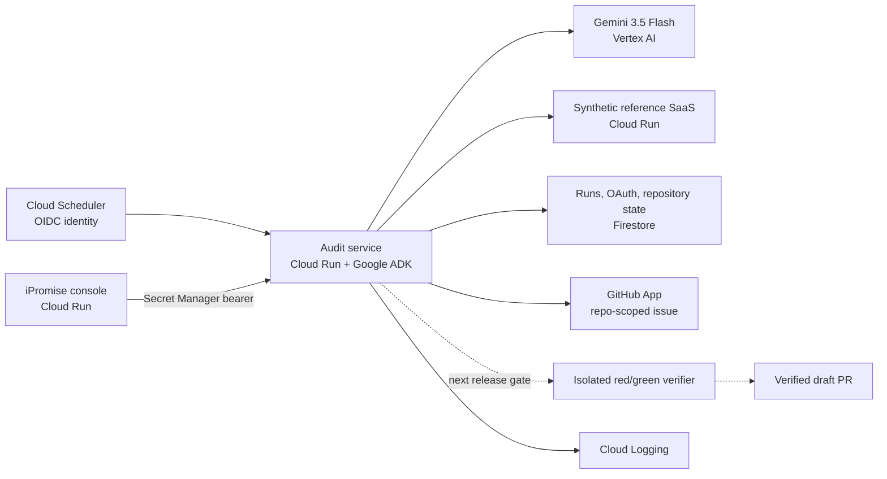
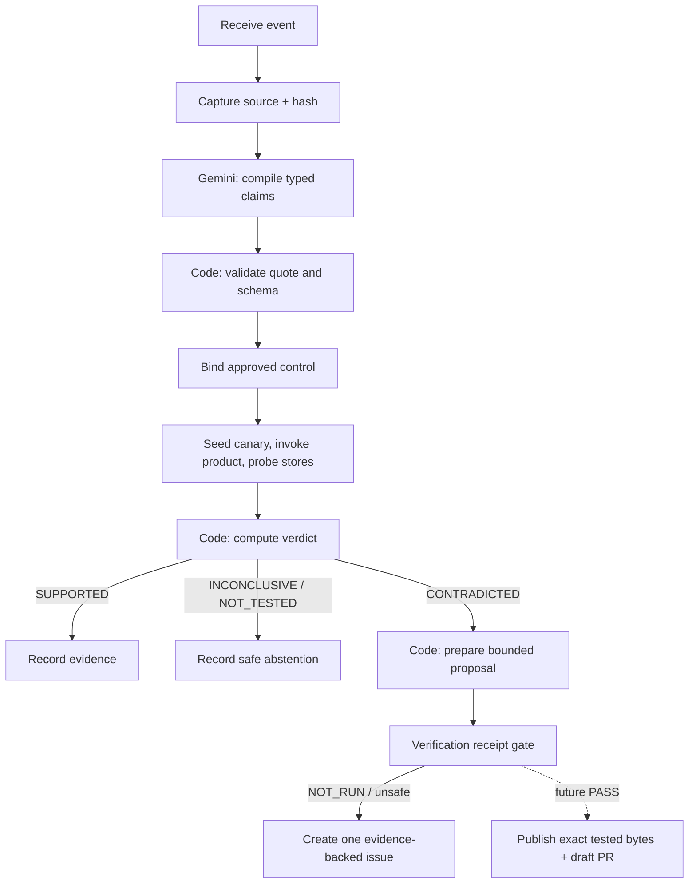

# iPromise architecture

Status: implemented minimum plus clearly marked verifier/PR target. See
[implementation status](implementation-status.md) for deployment proof.

iPromise is a scheduled promise-to-proof-to-action workflow. It is designed for the
hackathon's **Taskmaster** track and deliberately avoids a chat-first interaction.
The authoritative eligibility and submission requirements are the
[official rules](https://allthingsagentichackathon.devpost.com/rules).

## System context



The SaaS and records in the primary demo are synthetic fixtures created solely to
exercise the workflow. They are not a live customer's systems, and the demo must
say so on screen and aloud.

## Workflow graph



The agent graph is explicit rather than prompt-only. Model nodes handle semantic
work; deterministic nodes own permissions, evidence, and side effects. See
[ADR 0003](adr/0003-agent-deterministic-boundary.md).

## Judge console contract

The interface stays deliberately small: one promise record, one **Run audit**
button, one authorized repository selector, evidence, the selected action, and a
collapsed activity record. The successful terminal link opens the actual GitHub
artifact. Email is not part of the current product surface.

The primary demo view must fit without navigation: exact promise and source at the
top, current run timeline in the center, and promise-versus-observation evidence
beside the resulting action. No chat box is part of the MVP.

## Run state

```text
RECEIVED -> CAPTURING -> COMPILING -> BINDING -> PROBING -> EVALUATING
         -> SUPPORTED | NOT_TESTED | INCONCLUSIVE
         -> REMEDIATING -> VERIFYING -> ROUTING_ACTION -> COMPLETE | FAILED_*
```

`FAILED_RETRYABLE` and `FAILED_SAFE` are workflow checkpoints, not evidence
verdicts. A bounded retry resumes the same `FAILED_RETRYABLE` run; `FAILED_SAFE`
does not resume automatically. Every transition emits a timestamped event tied to one run ID.
Cloud Scheduler supplies its job name and scheduled time; their hash initializes
the idempotency key. Manual calls may supply an explicit key. GitHub issues carry
a deterministic hidden marker and are reconciled before publication. A
transactional run lease prevents a second Cloud Run instance or revision from
executing the same nonterminal run concurrently.

## MVP claim and control

The captured reference promise states that deleting an account removes its
profile and activity data from active systems within a stated deadline. The
registered `privacy.account_deletion.v1` control:

1. creates a stable, run-derived pseudonymous synthetic user;
2. records a synthetic deletion request old enough to cross the stated deadline;
3. invokes the deployed deletion endpoint;
4. probes both registered synthetic stores;
5. produces typed observations, computes the deterministic scoped verdict, and
   checkpoints both together in the run record.

The current registered adapter has an explicit two-store scope: application
profiles and analytics profiles. Unknown or unavailable results in either probe
make the result `INCONCLUSIVE`; they never silently count as deleted. A versioned,
configurable system inventory is a production hardening target.

## Data model

| Collection/object | Purpose |
| --- | --- |
| `audit_runs` | Full typed run checkpoints, execution/action leases, and judge-visible timeline |
| `audit_idempotency` | Atomic trigger-key to run mapping |
| `github_oauth_states` | Hashed, single-use install/OAuth state and PKCE verifier |
| `github_connections/active` | Verified installation repositories and selected numeric repository ID |
| `github_issue_intents` | Stable finding fingerprint, lease owner, expiry, and proven GitHub receipt |
| Future verifier receipt | Base SHA, bounded proposal, red/green results, exact candidate tree |

Judge-facing views expose only the bounded run document and redact credentials,
OAuth tokens, raw prompts, and synthetic-user identifiers from GitHub issues.

## Deployment and trust boundaries

- The console has a judge-accessible network URL but fails closed on Cloud Run
  without a strong access code. Its signed HttpOnly session gates the UI and all
  mutating proxy routes. The server-side proxy reads only the agent bearer secret
  and never exposes it to the browser.
- The minimum agent has a public network endpoint with application-layer auth.
  Console calls use a high-entropy bearer; Scheduler calls use Google OIDC with
  an exact audience and allowlisted service-account email. Those credential
  types are not interchangeable: OIDC is accepted only by the scheduled-trigger
  route, while the console bearer is accepted only by manual audit and GitHub
  routes. A private service-to-service console path is the production hardening target.
- Vertex AI is accessed using Application Default Credentials and a dedicated
  service identity. See the [Vertex AI quickstart](https://cloud.google.com/vertex-ai/generative-ai/docs/start/quickstart).
- Short-lived GitHub App installation tokens are acquired only for the selected
  repository and needed operation.
- The future verifier will have no egress and no cloud or GitHub secrets. Until
  that receipt exists, the code-enforced action policy blocks every draft PR.
- Maximum instances, request timeouts, budget alerts, retention, and cleanup are
  bounded before public deployment.

## Local presentation mode

Local mode exists for development and reproducible tests. It may use local fixture
storage and displays the persistent header state **Local · Synthetic data**.
It must never display Cloud Run, Gemini, or external-action proof without the
corresponding persisted receipt.
Local mode does not satisfy the hackathon's deployment requirement and must never
be presented as evidence of Cloud Run, Vertex AI, Firestore, or a real GitHub
action.
